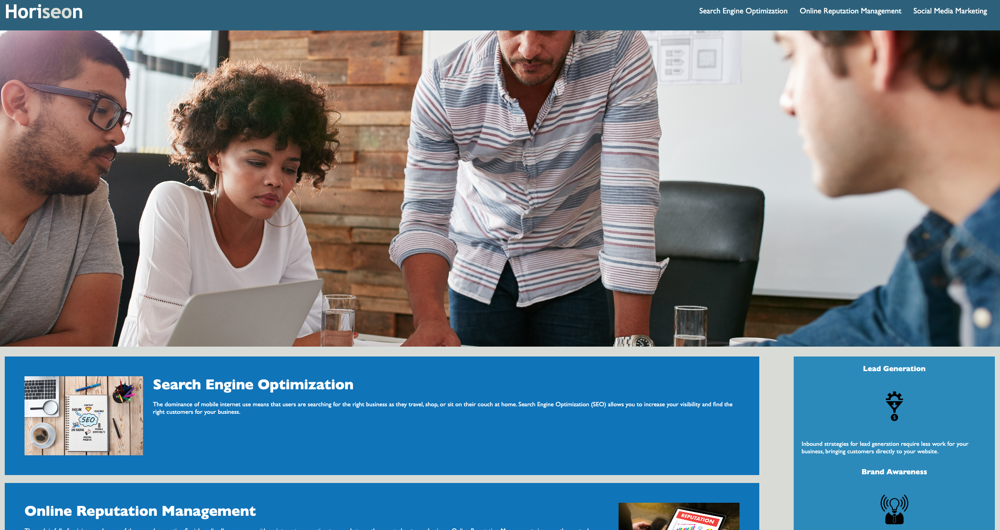

# challenge-week1 Horiseon
> This webpage now has a codebase that follows accessibility standards, and so that the site is optimized for search engines.
> Live demo [_here_](https://kristinehkim.github.io/challenge-week1/). <!-- If you have the project hosted somewhere, include the link here. -->

## General Information
This webpage's code has been cleaned up and meets accessibility standards.  When one views the source code, there are semantic HTML elements (div changed to section, main, aside, etc.)  One will find that the elements follow a logical structure independent of styling and positioning.  The image and icon elements now have accessible alt attributes and everything is in sequential order.
<!-- You don't have to answer all the questions - just the ones relevant to your project. -->

## Features
List the ready features here:
- Links function correctly.
- Comments in the CSS stylesheet.
- HTML and CSS selectors and properties are consolidated and organized.
- Detailed alt attributes included for screen readers and easier access for people with disabilities.

## Screenshots

<!-- If you have screenshots you'd like to share, include them here. -->

## Setup
HTML is organized with semantic elements by using header, section, main, aside. and footer.  CSS has been organized and consolidated into specific classes in order to avoid redundancy and save codespace.

## Usage
The links in the nav bar located on the top right of the webpage will jump down to that section of the page. Alt attributes have been added so people with disabilities have web accessibility.  Screen readers can read the description of images for people with visual disabilities.  It is also easier for search engines to find the webpage since there is now a title for the entire wepage which shows in the tab and is the company name, Horiseon.

## Project Status
Project is: _in progress_ 

## Acknowledgements
- Many thanks to my instructor, Michael Pacheco, our TAs. Nirav Venkatesan and Julius Dorfman, and the tutor I worked with, Dane Shrewsbury.
- I worked in study groups with Nhadea Lensky, Oswaldo Felix Thompson

## Contact
Created by Kristine Kim, feel free to contact me at kristinehkim@gmail.com.

<!-- Optional -->
<!-- ## License -->
<!-- This project is open source and available under the [... License](). -->

<!-- You don't have to include all sections - just the one's relevant to your project -->